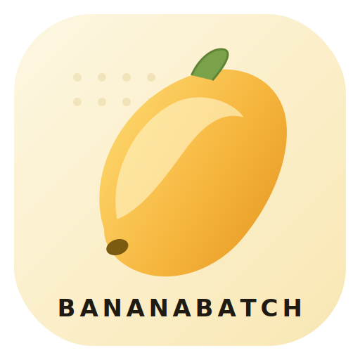
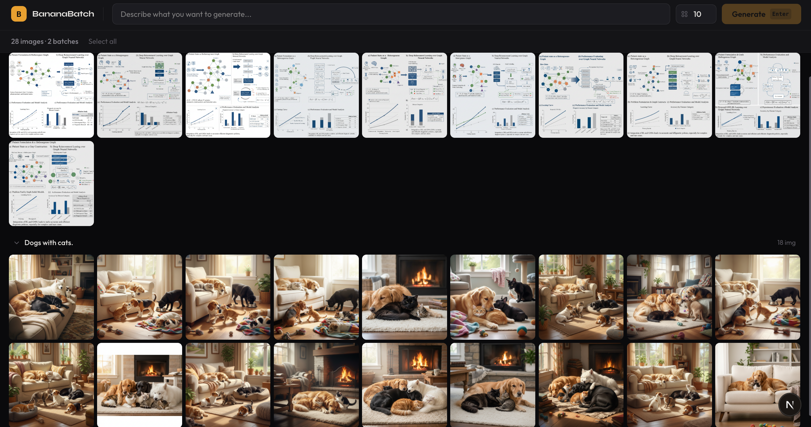
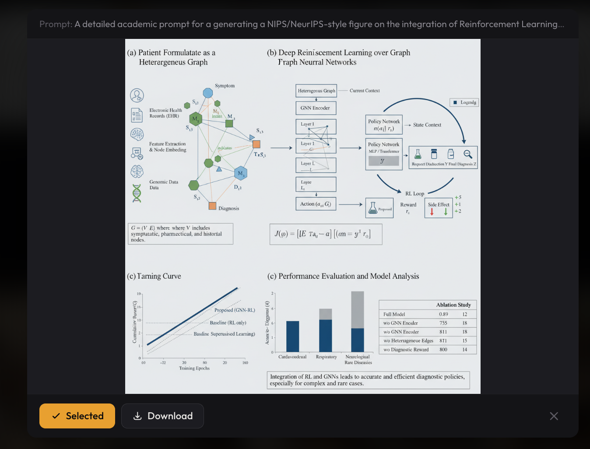

<p align="center">
  
</p>

<h1 align="center">BananaBatch</h1>

  <p align="center">
    <strong>One prompt. One batch.<br>
    Keep the ones you like.</strong>
  </p>

---

<p align="center">
  
</p>

## Quickstart

```bash
git clone https://github.com/DocZbs/BananaBatch.git 
cd BananaBatch
npm install
cp .env.example .env   # fill in your API credentials
npm run dev             # open http://localhost:3000
```

### .env

```
BASE_URL=https://your-api-base-url.com/v1
API_KEY=your-api-key-here
MODEL=gemini-2.5-flash-image-preview
```

## Usage

1. Enter a prompt in the top bar, set batch size
2. Press **Generate** or **Cmd+Enter** from anywhere
3. Images stream in as they complete
4. Click to select, expand to preview, download your favorites
5. New prompts add to the gallery — previous results stay

<p align="center">
  
</p>

> All demo images in `assets/` were generated by **gemini-2.5-flash-image-preview** for testing purposes.

## License

MIT - **Boshi Zhang @ Tsinghua University** - See [LICENSE](LICENSE)
